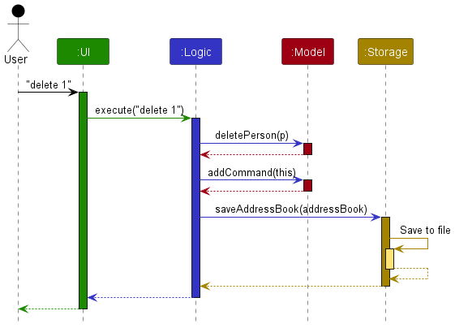
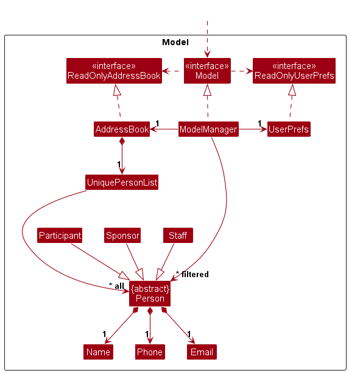
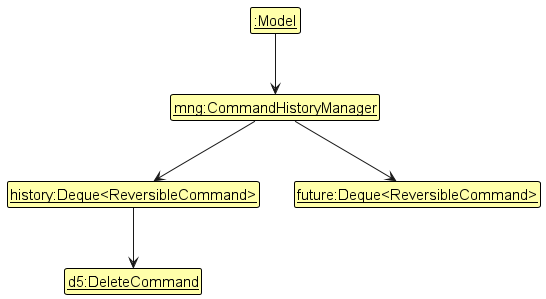
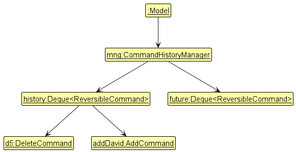
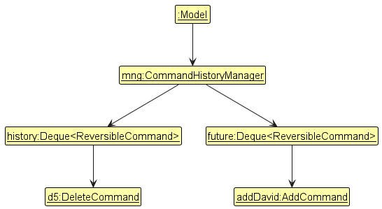
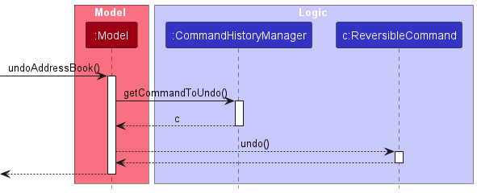
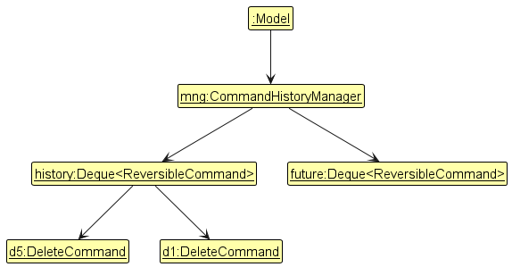
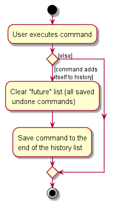
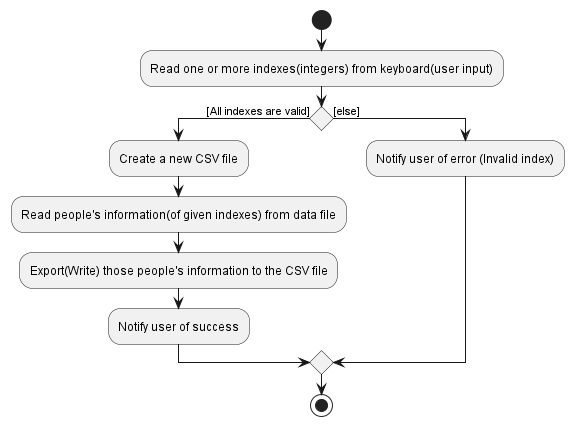

* TOC
{:toc}

---

## **Acknowledgements**

This project is based on the AddressBook-Level3 project created by the [SE-EDU initiative](https://se-education.org).

---

## **Setting up, getting started**

Refer to the guide [_Setting up and getting started_](SettingUp.md).

---

## **Design**

:bulb: **Tip:** The `.puml` files used to create diagrams in this document `docs/diagrams` folder. Refer to the [
_PlantUML Tutorial_ at se-edu/guides](https://se-education.org/guides/tutorials/plantUml.html) to learn how to create
and edit diagrams.

### Architecture

The **_Architecture Diagram_** given above explains the high-level design of the App.

Given below is a quick overview of main components and how they interact with each other.

**Main components of the architecture**

**`Main`** (consisting of
classes [`Main`](https://github.com/AY2324S2-CS2103T-F12-4/tp/tree/master/src/main/java/seedu/address/Main.java)
and [`MainApp`](https://github.com/AY2324S2-CS2103T-F12-4/tp/tree/master/src/main/java/seedu/address/MainApp.java)) is
in charge of the app launch and shut down.

- At app launch, it initializes the other components in the correct sequence, and connects them up with each other.
- At shut down, it shuts down the other components and invokes cleanup methods where necessary.

The bulk of the app's work is done by the following four components:

- [**`UI`**](#ui-component): The UI of the App.
- [**`Logic`**](#logic-component): The command executor.
- [**`Model`**](#model-component): Holds the data of the App in memory.
- [**`Storage`**](#storage-component): Reads data from, and writes data to, the hard disk.

[**`Commons`**](#common-classes) represents a collection of classes used by multiple other components.

**How the architecture components interact with each other**

The _Sequence Diagram_ below shows how the components interact with each other for the scenario where the user issues
the command `delete 1`.

Each of the four main components (also shown in the diagram above),

- defines its _API_ in an `interface` with the same name as the Component.
- implements its functionality using a concrete `{Component Name}Manager` class (which follows the corresponding
  API `interface` mentioned in the previous point.

For example, the `Logic` component defines its API in the `Logic.java` interface and implements its functionality using
the `LogicManager.java` class which follows the `Logic` interface. Other components interact with a given component
through its interface rather than the concrete class (reason: to prevent outside component's being coupled to the
implementation of a component), as illustrated in the (partial) class diagram below.

The sections below give more details of each component.

### UI component

The **API** of this component is specified
in [`Ui.java`](https://github.com/AY2324S2-CS2103T-F12-4/tp/tree/master/src/main/java/seedu/address/ui/Ui.java)

The UI consists of a `MainWindow` that is made up of parts
e.g.`CommandBox`, `ResultDisplay`, `PersonListPanel`, `StatusBarFooter` etc. All these, including the `MainWindow`,
inherit from the abstract `UiPart` class which captures the commonalities between classes that represent parts of the
visible GUI.

The `UI` component uses the JavaFx UI framework. The layout of these UI parts are defined in matching `.fxml` files that
are in the `src/main/resources/view` folder. For example, the layout of
the [`MainWindow`](https://github.com/AY2324S2-CS2103T-F12-4/tp/tree/master/src/main/java/seedu/address/ui/MainWindow.java)
is specified
in [`MainWindow.fxml`](https://github.com/AY2324S2-CS2103T-F12-4/tp/tree/master/src/main/resources/view/MainWindow.fxml)

The `UI` component,

- executes user commands using the `Logic` component.
- listens for changes to `Model` data so that the UI can be updated with the modified data.
- keeps a reference to the `Logic` component, because the `UI` relies on the `Logic` to execute commands.
- depends on some classes in the `Model` component, as it displays `Person` object residing in the `Model`.

### Logic component

**API**:
[`Logic.java`](https://github.com/AY2324S2-CS2103T-F12-4/tp/tree/master/src/main/java/seedu/address/logic/Logic.java)

Here's a (partial) class diagram of the `Logic` component:

The sequence diagram below illustrates the interactions within the `Logic` component, taking `execute("delete 1")` API
call as an example.

:information_source: **Note:** The lifeline for `DeleteCommandParser` should end at the destroy marker (X) but due to a limitation of PlantUML, the lifeline continues till the end of diagram.

How the `Logic` component works:

1. When `Logic` is called upon to execute a command, it is passed to an `AddressBookParser` object which in turn creates
   a parser that matches the command (e.g., `DeleteCommandParser`) and uses it to parse the command.
2. This results in a `Command` object (more precisely, an object of one of its subclasses e.g., `DeleteCommand`) which
   is executed by the `LogicManager`.
3. The command can communicate with the `Model` when it is executed (e.g. to delete a person). 
   Note that although this is shown as a single step in the diagram above (for simplicity), in the code it can take
   several interactions (between the command object and the `Model`) to achieve.
4. The result of the command execution is encapsulated as a `CommandResult` object which is returned back from `Logic`.

Here are the other classes in `Logic` (omitted from the class diagram above) that are used for parsing a user command:

How the parsing works:

- When called upon to parse a user command, the `AddressBookParser` class creates an `XYZCommandParser` (`XYZ` is a
  placeholder for the specific command name e.g., `AddCommandParser`) which uses the other classes shown above to parse
  the user command and create a `XYZCommand` object (e.g., `AddCommand`) which the `AddressBookParser` returns back as
  a `Command` object.
- All `XYZCommandParser` classes (e.g., `AddCommandParser`, `DeleteCommandParser`, ...) inherit from the `Parser`
  interface so that they can be treated similarly where possible e.g, during testing.

### Model component

**API** :
[`Model.java`](https://github.com/AY2324S2-CS2103T-F12-4/tp/tree/master/src/main/java/seedu/address/model/Model.java)

The `Model` component,

- stores the contact list data i.e., all `Person` objects (which are contained in a `UniquePersonList` object).
- stores the currently 'selected' `Person` objects (e.g., results of a search query) as a separate _filtered_ list which
  is exposed to outsiders as an unmodifiable `ObservableList<Person>` that can be 'observed' e.g. the UI can be bound to
  this list so that the UI automatically updates when the data in the list change.
- stores a `UserPref` object that represents the user’s preferences. This is exposed to the outside as
  a `ReadOnlyUserPref` objects.
- does not depend on any of the other three components (as the `Model` represents data entities of the domain, they
  should make sense on their own without depending on other components)

### Storage component

**API** :
[`Storage.java`](https://github.com/AY2324S2-CS2103T-F12-4/tp/tree/master/src/main/java/seedu/address/storage/Storage.java)

The `Storage` component,

- can save both address book data and user preference data in JSON format, and read them back into corresponding
  objects.
- inherits from both `AddressBookStorage` and `UserPrefStorage`, which means it can be treated as either one (if only
  the functionality of only one is needed).
- depends on some classes in the `Model` component (because the `Storage` component's job is to save/retrieve objects
  that belong to the `Model`)

### Common classes

Classes used by multiple components are in the `seedu.addressbook.commons` package.

---

## **Implementation**

This section describes some noteworthy details on how certain features are implemented.

### Undo/redo feature

#### Implementation

The undo/redo feature is implemented using the following components:

- `ReverisbleCommand` interface. This interface defines two methods:

    - `ReversibleCommand#undo(Model model)`— Reverts the command and returns a `CommandResult`.
    - `ReversibleCommand#redo(Model model)`— Re-executes the command and returns a `CommandResult`.

  `ReversibleCommand` interface is used in conjunction with the abstract `Command` class. Commands that support
  undo/redo
  implement this interface.

- `CommandHistoryManager` class. This class is responsible for managing the undo/redo history. It maintains 2 lists
  of `ReversibleCommand` objects: `history` and `future`.

    - `history` contains the commands that have been executed and can be undone. New commands are added to the end of
      the list.
    - `future` contains the commands that have been undone and can be redone.

    
   `CommandHistoryManager` provides the following methods:

    - `CommandHistoryManager#addCommand(ReversibleCommand command)`— Adds a command to the `history` list and clears
      the `future` list.
    - `CommandHistoryManager#getCommandToUndo(Model model)`— Returns the last command in the `history` list and moves it
      to the end of the `future` list.
    - `CommandHistoryManager#getCommandToRedo(Model model)`— Returns the last command in the `future` list and moves it
      to the end of the `history` list.

These operations are exposed in the `Model` interface
as `Model#addCommand(ReversibleCommand)`, `Model#undoAddressBook()`
and `Model#redoAddressBook()` respectively.

Given below is an example usage scenario and how the undo/redo mechanism behaves at each step.

**Step 1.** The user launches the application. The `CommandHistoryManager` is initialized with empty `history`
and `future` lists.

**Step 2.** The user executes `delete 5` command to delete the 5th person in the address book. The `delete` command
calls `Model#addCommand(ReversibleCommand)` to add the itself to the `history` list.

**Step 3.** The user executes `add n/David …​` to add a new person. The `add` command also
calls `Model#addCommand(ReversibleCommand)` to add itself to the `history` list.

:information_source: **Note:** If a command fails its execution, it will not call `Model#addCommand(ReversibleCommand)`, so the command will not be added to the `history` list. This ensures that only successful commands are added to the history.

**Step 4.** The user decides to undo the `add n/David …​` command by executing the `undo` command. The `undo` command
calls `Model#undoAddressBook()`, which retrieves the last command from the `history` list and
calls `ReversibleCommand#undo(Model model)` on it. The add command is removed from the `history` list and added to
the `future` list.

:information_source: **Note:** If the `history` list is empty, there is no command to undo.
The `undo` command uses `Model#canUndoAddressBook()` to check if this is the case. If so, it will return an error to the user rather
than attempting to perform the undo. Similarly, the `redo` command uses `Model#canRedoAddressBook()` to check if the `future` list is empty.

The following sequence diagram shows how an undo operation goes through the `Logic` component:

:information_source: **Note:** The lifeline for `UndoCommand` should end at the destroy marker (X) but due to a limitation of PlantUML, the lifeline reaches the end of diagram.

Similarly, how an undo operation goes through the `Model` component is shown below:

The `redo` command is similar — it calls `Model#redoAddressBook()`, which retrieves the last command from the `future`
list and calls `ReversibleCommand#redo(Model model)` on it.

**Step 5.** The user then decides to execute the command `list`. Commands that do not modify the data, such
as `list`, will usually not call `Model#addCommand()`, `Model#undoAddressBook()` or `Model#redoAddressBook()`.
Thus, the `history` list remains unchanged.

**Step 6.** The user executes `delete 1`, which calls `Model#addCommand(ReversibleCommand)`. The `future` list, which
contains the previous `add n/David...` command, is cleared.
Reason: It no longer makes sense to redo the `add n/David …​` command, since `delete 1` may affect the added person.
This is the behavior that most modern desktop applications follow.

The following activity diagram summarizes what happens when a user executes a new command:

#### Design considerations:

**Aspect: How undo & redo executes:**

- **Alternative 1:** Saves the entire address book.

    - Pros: Easy to implement.
    - Cons: May have performance issues in terms of memory usage.

- **Alternative 2 (current choice):** Individual command knows how to undo/redo by
  itself.
    - Pros: Will use less memory (e.g. for `delete`, just save the person being deleted).
    - Cons: We must ensure that the implementation of each individual command are correct.

_{more aspects and alternatives to be added}_

### \[Proposed\] Link Feature

#### Implementation

The activity diagram below illustrates the flow of the `link` command.

---

## **Documentation, logging, testing, configuration, dev-ops**

- [Documentation guide](Documentation.md)
- [Testing guide](Testing.md)
- [Logging guide](Logging.md)
- [Configuration guide](Configuration.md)
- [DevOps guide](DevOps.md)

---

## **Appendix: Requirements**

### Product scope

**Target user profile**: A student hackathon organizer who,

- has a need to manage a significant number of contacts
- prefer desktop apps over other types
- can type fast
- prefers typing to mouse interactions
- is reasonably comfortable using CLI apps

**Value proposition**: Manage participant contacts, staff information & sponsor contacts, schedule event logistics,
and , offering a dedicated tool to optimize hackathon planning. Optimized for user preferring CLI.

### User stories

Priorities: High (must have) - `* * *`, Medium (nice to have) - `* *`, Low (unlikely to have) - `*`

| Priority | As a …​                     | I want to …​                                     | So that I can…​                                               |
|----------|-----------------------------|--------------------------------------------------|---------------------------------------------------------------|
| `* * *`  | Student Hackathon Organizer | Add new participants to the contact managing app | Have a centralized database of all hackathon attendees.       |
| `* * *`  | Student Hackathon Organizer | Update and edit participant contact details      | Ensure accurate and up-to-date information.                   |
| `* * *`  | Student Hackathon Organizer | Add notes or comments to contact                 | Provide additional context or reminders for each contact.     |
| `* *`    | Student Hackathon Organizer | View contact count in the database               | Know the number of participants, staff, etc. in the event     |
| `* * *`  | Student Hackathon Organizer | List out members                                 | See all the members in one go                                 |
| `* * *`  | Student Hackathon Organizer | Remove specific participants                     | Remove participants who signed up but unable to participate.  |
| `* * *`  | Student Hackathon Organizer | Remove specific participants                     | remove participants who signed up but unable to participate. |
| `* * *`  | Student Hackathon Organizer | Group specific participants                      | Know which participants are working together.                |
| `* * *`  | Student Hackathon Organizer | Group specific staff                             | Assign easily a staff to a group.                            |
| `* * *`  | Student Hackathon Organizer | Randomly group all participants                  | Quickly ensure that all participants have a group.           |
| `* * *`  | Student Hackathon Organizer | Add events for specific categories of people     | Have a database with all the events related to hackathon.     |
| `* * *`  | Student Hackathon Organizer | Delete event                                     | Remove events that have been cancelled or no longer relevant. |
| `* * *`  | Student Hackathon Organizer | Find events                                      | Find details such as date and category of an upcoming event   |
| `* * *`  | Student Hackathon Organizer | List events                                      | Have an overall view of all the events in one go.             |
| `* *`    | Student Hackathon Organizer | Clear all events                                 | Remove all sample data and start with my own.                 |
| `* * *`  | Student Hackathon Organizer | Revert the change made to the database           | Correct any mistakes made while managing the database.        |
| `* *`    | Student Hackathon Organizer | Redo the change made to the database             | Reapply any changes that were undone.                         |
| `* *`    | Student Hackathon Organizer | Export a list of people to a CSV file            | Share the list with other organizers or for record-keeping.   |
| `* *`    | Student Hackathon Organizer | Import a list of people from a CSV file          | Quickly add a large number of contacts to the database.       |
| `* *`    | Fast typist                 | Use keyboard shortcuts to perform common tasks   | Save time and effort in navigating and managing the app.      |
| `* * *`  | Student Hackathon Organizer | See the output of my command                     | Confirm that my command was executed correctly.               |
| `* * *`  | Student Hackathon Organizer | Get help on how to use the app                   | Understand how to use the app effectively.                    |
| `* * *`  | Student Hackathon Organizer | Exit the app                                     | Close the app when I am done.                                 |
| `* *`    | Student Hackathon Organizer | Save the data automatically                      | Ensure that my data is always up to date.                     |
| `* *`    | Student Hackathon Organizer | See error messages when I enter invalid commands | Understand what went wrong and how to correct it.             |
| `* * *`  | Student Hackathon Organizer | View commands I have entered                     | Recall what I have done previously.                           |

### Use cases

(For all use cases below, the **System** is the `HackLink` and the **Actor** is the `user`, unless specified
otherwise)

**Use case: Add a Contact**

**MSS**

1. User requests to add a new contact.
2. System prompts for contact details: name, email, phone, category.
3. User provides valid information.
4. System validates input and adds the contact to the list.
5. System displays a success message.

   Use case ends.

**Extensions**

3a. Invalid input provided.

- System displays an error message.
- Use case ends.

 

**Use case: View Participant List**

**MSS**

1. User requests to view the list of all participants.
2. System displays the list with relevant information.
3. System shows the total count of participants.

   Use case ends.

 

**Use case: Update Participant Contact Details**

**MSS**

1. User requests to update contact details for a specific participant.
2. System prompts for the participant's name and the field to update.
3. User provides valid information.
4. System validates input and updates the contact details.
5. System displays a success message.

   Use case ends.

**Extensions**

3a. Invalid input provided.

- System displays an error message.
- Use case ends.

 

**Use case: Comment**

**MSS**

1. User requests to add notes or comments to a participant.
2. System prompts for the participant's name and the notes.
3. User provides notes.
4. System adds the notes to the participant's profile.
5. System displays a success message.

   Use case ends.

**Extensions**

3a. No notes provided.

- System displays an error message.
- Use case ends.

 

**Use case: Remove Participant**

**MSS**

1. User requests to remove a specific participant.
2. System prompts for the participant's ID.
3. User provides the ID.
4. System deletes the participant.
5. System displays a success message.

   Use case ends.

**Extensions**

3a. Participant not found.

- System displays an error message.
- Use case ends.

 

**Use case: Group A Participant**

**MSS**

1. User requests to group a specific participant to a specific group.
2. User provides valid information: participant's ID and group number.
3. System groups the participant into the group number.
4. System displays a success message.

   Use case ends.

**Extensions**

2a. Invalid input provided.

- System displays an error message.
- Use case ends.

 

**Use case: Randomly Group All Participant**

**MSS**

1. User requests to find participant in the current list.
2. User requests to group randomly all persons in the current list.
3. User provides valid maximum group size.
4. System assigns randomly all participants into a group, where each group
   size is less than or equal to the maximum group size.
5. System displays a success message.

   Use case ends.

**Extensions**

3a. Invalid maximum group size provided.

- System displays an error message.
- Use case ends.

 

**Use case: Add Events**

**MSS**

1. User requests to add an new event.
2. User provides valid information for contact details: name, date, and category.
3. System validates input and adds the event to the list.
4. System displays a success message.

   Use case ends.

**Extensions**

2a. Invalid input provided.

- System displays an error message.
- Use case ends.

 

**Use case: Remove Event**

**MSS**

1. User requests to remove an specific event.
2. User provides the ID of event to be removed.
3. System deletes the event.
4. System displays a success message.

   Use case ends.

**Extensions**

2a. Event not found.

- System displays an error message.
- Use case ends.

 

**Use case: View Events List**

**MSS**

1. User requests to view the list of all events.
2. System displays the list with relevant information.
   Use case ends.

 

**Use case: Revert last change**

**MSS**

1. User requests to revert the last change made to the database.
2. System reverts the last change made to the database.
3. System displays a success message.

   Use case ends.

**Extensions**
1a. No changes to revert.
   1a1. System displays an error message.
   Use case ends.

### Non-Functional Requirements

1. Should work on any _mainstream OS_ as long as it has Java `11` or above installed.
2. Should be able to hold up to 1000 persons without a noticeable sluggishness in performance for typical usage.
3. The application should be designed to scale gracefully, accommodating an increase in the number of participants or
   contacts without significant degradation in performance.
4. The codebase should follow best practices and be well-documented to facilitate future maintenance and updates by
   developers.
5. The system should provide clear and user-friendly error messages for invalid inputs or failed operations, aiding
   users in understanding and resolving issues.

### Glossary

- **Mainstream OS**: Windows, Linux, Unix, MacOS
- **Java 11**: A version of the Java programming language and runtime environment, required for running the application
- **Participant**: An individual registered to participate in the hackathon
- **ID**: A unique identifier assigned to each participant in the system

---

## **Appendix: Instructions for manual testing**

Given below are instructions to test the app manually.

:information_source: **Note:** These instructions only provide a starting point for testers to work on;
testers are expected to do more *exploratory* testing.

### Launch and shutdown

1. Initial launch

    1. Download the jar file and copy into an empty folder

    2. Ensure that the current Java version is 11 by running `java -v` in the terminal

    3. After verifying the Java version, open a terminal in the same directory as the jar file and run the jar file by running `java -jar hacklink.jar` in the terminal. `hacklink.jar` is the name of the jar file. 
    Expected: The app launches successfully and the main window is displayed with sample data.

2. Saving window preferences

    1. Resize the window to an optimum size. Move the window to a different location. Close the window.

    2. Re-launch the app as instructed in step 1.3. 
       Expected: The most recent window size and location is retained.

### Deleting a person

1. Deleting a person while all persons are being shown

    1. Prerequisites: List all persons using the `list` command. Multiple persons in the list.

    1. Test case: `delete 1` 
       Expected: First contact is deleted from the list. Details of the deleted contact shown in the status message.

    1. Test case: `delete 0` 
       Expected: No person is deleted. Error details shown in the status message.

    1. Other incorrect delete commands to try: `delete`, `delete x`, `...` (where x is larger than the list size) 
       Expected: Similar to previous.

1. Deleting a person while a filtered list is being shown

   1. Prerequisites: Filter the list using the `find` command (e.g., `find alex`). Multiple persons in the filtered list.

   1. Test case: `delete 1` 
      Expected: First contact in the filtered list is deleted. Details of the deleted contact shown in the status message. No change in the contacts that are not in the filtered list.

   1. Test case: `delete 0` 
      Expected: No person is deleted. Error details shown in the status message. No change in the contacts that are not in the filtered list.

   1. Other incorrect delete commands to try: `delete`, `delete x`, `...` (where x is larger than the filtered list size) 
      Expected: Similar to previous.

### Saving data

1. Dealing with missing/corrupted data files

    1. Delete the data file (e.g., `HackLinkData.json`) from the data directory.

   2. Relaunch the app. 
      Expected: The app should create a new data file and load with sample data.

### Undo/Redo

1. Undoing a command

    1. Prerequisites: Add a new person using the `add` command.

    2. Test case: `undo` 
       Expected: The last command (add) is undone. The person added should be removed from the list.

    3. Other commands with extraneous parameters: `undo x`, `undo add`, `undo delete` 
       Expected: Similar to previous.

1. Redoing a command

   1. Prerequisites: Undo the last command (add).

   2. Test case: `redo` 
      Expected: The last undone command (add) is redone. The person added should be re-added to the list.

   3. Other commands with extraneous parameters: `redo x`, `redo add`, `redo delete` 
      Expected: Similar to previous.

1. Redoing after new changes are made

   1. Prerequisites: Undo the last command (add).

   2. Test case: 
   - Add new person: `add n/John p/98765432 e/john@email.com c/participant`
   - Redo the last undone command: `redo` 
     Expected: The redo command should fail with an error message.

### Grouping a person

1. **Randomly grouping a participant or staff without prior existing groups**
   1. Prerequisites: Delete addressbook.json in the data folder.
   2. Test case: `group x` (where x is the index of a participant or staff) 
      Expected: No person is grouped. Error details shown in the status message.
2. **Group a person into a participant or staff into a specific group number.**
   1. Prerequisites: A participant or a staff is in the list.
   2. Test case: `group x 1` (where x is the index of a participant or staff) 
      Expected: First contact is assigned into group 1. Details of the grouped contact shown in the status message.
   3. Test case: `group x -1` (where x is the index of a participant or staff) 
      Expected: No person is grouped. Error details shown in the status message.
3. **Randomly grouping a participant into an existing groups**
   1. Prerequisites: There exist a positive (non-zero) group number in the list. 
      If they don't exist, input `group x 5` (where x is the index of a participant or staff)
   2. Test case: `group x` (where x is the index of a participant or staff) 
      Expected: First person is assigned into a random existing group.

### Group randomly all persons

1. **Randomly grouping all participants and staffs in the list**
   1. Prerequisites: Multiple persons in the list.
   2. Test case: `grouprandom 3` 
      Expected: All participants and staffs are assigned into a random group number.
      Each group have less than or equal to 3 members.
   3. Test case: `grouprandom x` (where x is larger than the list size)  
      Expected: All participants and staffs are assigned into group 1.
   4. Test case: `grouprandom 0` 
      Expected: No person is grouped. Error details shown in the status message.

### Adding events

1. **Access the "Add Event" Functionality**:
    - Navigate to the events window by clicking on Events in the top menu bar and followed by show Events, where you
      will be brought to the events window.

2. **Input Form**:
    - Input the correct addevent command including name, date, and category following the appropriate format.
    - Validate that the command handles various data types and formats correctly (e.g., date format (dd-MM-YYYY) should
      be enforced).

3. **Submit Event**:
    - Press enter submit the event.

4. **Verification**:
    - Verify that the event is successfully added to the event list.
    - Confirm that the details provided during input match the details displayed for the newly added event.

### Deleting Event

1. **Access the "Delete Event" Functionality**:
    - Navigate to the events window by clicking on Events in the top menu bar and followed by show Events, where you
      will be brought to the events window.

2. **Select Event to Delete**:
    - Identify an event and its index from the list that you want to delete.

3. **Deletion**:
    - Input the delete event command to delete the event.

4. **Verification**:
    - Ensure that the event you selected for deletion is no longer present in the event list.

### Finding an event

1. **Input Search Query**:
    - Enter findevent followed by the keyword related to the event you want to find.
    - Try different search terms and variations to test the search functionality comprehensively.

2. **Initiate Search**:
    - Press Enter to execute the search.

3. **Review Results**:
    - Check the search results to ensure they match the criteria you specified.
    - Verify that the search results include relevant events based on your input.

### Listing events

1. **View Event List**:
    - Confirm that the list displays all events currently available in the system.
    - Verify that the events are listed in a clear and organized manner.

2. **Scrolling and Pagination**:
    - If the event list is extensive, test scrolling and pagination features to navigate through the list effectively.

### Clearing events

2. **Initiate Clearing**:
    - Input the clear command to clear all events from the system.

4. **Verification**:
    - Ensure that all events are removed from the event list.
    - Verify that the event list is empty after clearing.

5. **Check Impact**:
    - If the application has related functionalities or features affected by event clearing (e.g., statistics, reports),
      verify that they are updated accordingly.
    - Confirm that there are no unintended side effects or data inconsistencies caused by clearing events.

## **Appendix: Planned Enhancements**

Team size: 4

1. **Add Confirmation Dialog for Delete Event**:
    - **Feature Flaw**: Currently, when a user executes the "delete event" command, the event is immediately removed
      without any confirmation. This can lead to accidental deletions.
    - **Proposed Fix**: Implement a confirmation dialog that prompts the user to confirm the deletion before proceeding.
      The dialog should display details of the event to be deleted and provide options to confirm or cancel the
      deletion.

2. **Implement restriction that events can only be added for the future for Add Event**:
    - **Feature Flaw**: Adding events with dates in the past might not be accurate as ideally hackathon organisers would
      want to schedule events in the future.
    - **Proposed Fix**: Introduce restrictions for the event date that can be specified in the add event command
    - **Example**: addevent en/meeting ed/30-12-2023 ec/staff will be considered invalid

3. **Proper undoing of deletion**:
   Currently, undoing a delete command adds the deleted person to the end of the contact list instead of their original
   position. This can be confusing for users who expect the undo operation to truely revert the deletion. We plan to
   re-implment the undo feature of the delete command to restore the deleted person to their original position in the
   contact list.

4. **Allow more flexible name for contact**:
   Currently, the name of a contact can only contain alphanumeric characters and spaces. We plan to allow more characters such as
   hyphens, periods, apostrophes, slashes, and commas in the name of a contact.

5. **Implement priority system when assigning a person into a random group with Group Command**:
   - **Feature Flaw**: Assigning a person to a totally random group might not be accurate as ideally hackathon would need groups with similar group sizes.
   - **Proposed Fix**: Implement a priority system where the group that have fewer members have higher priority

6. **Add an option to not include existing groups for GroupRandom Command**:
   - **Feature Flaw**: Currently, GroupRandom Command will be randomly assigning group numbers, that ranges from 1 to a certain number. This is not ideal for when a hackathon organiser wants to randomize a subset of the contacts without changing the existing groups.
   - **Proposed Fix**: Introduce an option to randomly assigning groups without modifying the existing group members.
     
## **Appendix: Effort**

Our project involved the development of a comprehensive event management system, which presented several challenges and
required significant effort. Unlike AB3, which deals with only one entity type (persons), our project dealt with
multiple entity types (events, persons: participants, staffs, sponsors), making it more complex.

**Difficulty Level:**

- The project's difficulty level was moderate to high due to the need to handle multiple entity types and implement
  various features such as grouping, undoing/redoing and event commands.

**Challenges Faced:**

- One challenge was ensuring the system's robustness and reliability, especially when handling complex data interactions
  and user inputs.

- We had to consider various scenarios that could result in a not so friendly user-friendly experience.

**Effort Required:**

- The project required a significant amount of effort from both development and testing perspectives. Development
  involved designing and implementing features, handling data storage and retrieval, and ensuring smooth system
  operations.
- Testing efforts were extensive to ensure the system's functionality and reliability.

**Achievements:**

- Despite the challenges, we successfully developed a functional and robust event management system that meets the
  project requirements and provides a seamless user experience.
- Our achievements include implementing key features such as grouping, undo/redo commands, creating CSV file and event
  commands, as well as ensuring data integrity and system stability.
