WELCOME TO HACKLINK!

## Introduction

Again, Welcome to HackLink! This user guide is designed to help you navigate and utilize this HackLink app to its full
potential. HackLink is a Hackathon Participant Management Application, designed to help organizers efficiently manage
contact information for hackathons. This app is aimed at simplifying the management of participant, staff, and sponsor's
information. With this user guide, you will easily and quickly learn to make use of important features, such as adding,
deleting, finding, and commenting contacts. you can streamline the complex process of organizing and coordinating your
hackathon event.

### Target Audience

This user guide is intended for hackathon organizers and coordinators who are looking for a simple and efficient way to
manage their hackathons. We assume that you have a basic understanding of hackathon event management and are familiar
with digital tools and CLI-based applications. However, even if you are new to hackathon management, this user guide
will help you get started with HackLink. No prior experience is required, as this guide will cover all the necessary
fundamentals to help you get started with HackLink.

### Purpose of this User Guide

The purpose of this user guide is to equip you with a thorough understanding of HackLink. This guide will provide a
comprehensive overview of the features and functionalities of HackLink. It will guide you through the process of
installing the application, understanding the UI(user interface), and using the various commands to manage your
hackathon event. This guide will also provide you with good examples and cautions to help you avoid errors and make the
best use of the application. By the end of this guide, you will be able to efficiently manage your hackathon
event using HackLink.

---

## Table of Contents

1. [Introduction](#introduction)
2. [Product Information Overview](#product-information-overview)
3. [Quick start](#quick-start)
4. [Main features](#main-features)
    - [Viewing help](#viewing-help--help)
    - [Adding a person](#adding-a-person--add)
    - [Listing all persons](#listing-all-persons--list)
    - [Editing a person](#editing-a-person--edit)
    - [Grouping a person](#grouping-a-person--group)
    - [Grouping randomly listed persons](#grouping-randomly-listed-persons--grouprandom)
    - [Commenting a person](#commenting-a-person--comment)
    - [Viewing comments](#viewing-comments--view)
    - [Locating persons by keywords](#locating-persons-by-keywords--find)
    - [Exporting selected people](#exporting-selected-people--link)
    - [Removing a person](#removing-a-person--delete)

5. [Event features](#event-features)
    - [Adding an event](#adding-an-event--addevent)
    - [Listing all events](#listing-all-events--listevent)
    - [Removing an event](#removing-an-event--deleteevent)
    - [Locating events by keywords](#locating-events-by-keywords--findevent)
    - [Clearing all entries](#clearing-all-entries--clear)
    - [Exiting the program](#exiting-the-program--exit)

6. [Utility features](#utility-features)
    - [Saving the data](#saving-the-data)
    - [Editing the data file](#editing-the-data-file)
    - [Navigating to older commands](#navigating-to-older-commands)
    - [Aliases](#aliases)
    - [Shortcuts](#shortcuts)
    - [Undo](#undo)
    - [Redo](#redo)

7. [Event window](#event-window)
8. [FAQ](#faq)
9. [Warnings](#warnings)
10. [Known issues](#known-issues)
11. [Tips](#tips)
12. [Command summary](#command-summary)

---

## Product Information Overview
HackLink allows you to manage your hackathon event efficiently by providing following features:
- Adding/Deleting a person
- Editing/List/Grouping/Commenting a person
- Finding a person by keywords
- Exporting selected people
- Managing events

---

## Quick start

To begin using HackLink, please follow these steps:

1. Ensure you have Java `11` or above installed in your Computer.

2. Download the latest `HackLink.jar` from [here](https://github.com/AY2324S2-CS2103T-F12-4/tp/releases).

3. Copy the file to the folder you want to use as the _home folder_ for your HackLink application.

4. Open a command terminal, `cd` into the folder you put the jar file in, and use the `java -jar HackLink.jar` command
   to run the application. 
   A GUI similar to the below should appear in a few seconds. Note how the app contains some sample data. 
   
5. Type the command in the command box and press Enter to execute it. e.g. typing **`help`** and pressing Enter will
   open the help window. 
   Some example commands you can try:

    - `list` : Lists all contacts.

    - `add n/John Doe p/98765432 e/johndoe@gmail.com c/participant` : Adds a person named `John Doe` to HackLink.

    - `delete 3` : Deletes the 3rd person shown in the current list.

    - `edit 1 p/89898989` : Updates the information of the person at index 1.

    - `comment 1 He is good at Java`: Adds a comment to the person at index 1.

    - `exit` : Exits the app.

6. Navigate to the Event Window by clicking on Events in the menubar. Refer to the [Event window](#event-window) section
   for more details.

7. Type the commands in the command box and press Enter to execute them.

    - `addevent en/Meeting ed/11-06-2024 ec/staff` : Adds an event named `meeting`.

    - `deleteevent 8` : Deletes the 8th event shown in the list.

    - `findevent meeting` : Finds events which names contain "meeting".

    - `listevent` : Lists all events.

    - `clear` : Clears all events

8. Refer to the [Main features](#main-features) below for details of each command.

### Navigating this User Guide

---

## Main features

**:information_source: Notes about the command format:** 

- Words in `UPPER_CASE` are the parameters to be supplied by the user. 
  e.g. in `add n/NAME`, `NAME` is a parameter which can be used as `add n/John Doe`.

- Items in square brackets `[]` are optional. 
  e.g. `n/NAME [g/GROUP]` can be used as `n/John Doe g/1` or as `n/John Doe`.

- Items with `…`​ after them can be used multiple times including zero times. 
  e.g. `[c/CATEGORY​]…` can be used as ` ` (i.e. 0 times), `c/staff`, `c/sponsor` etc.

- Parameters can be in any order. 
  e.g. if the command specifies `n/NAME p/PHONE_NUMBER`, `p/PHONE_NUMBER n/NAME` is also acceptable.

- Extraneous parameters for commands that do not take in parameters (such as `help`, `list`, `exit` and `clear`) will be
  ignored. 
  e.g. if the command specifies `help 123`, it will be interpreted as `help`.

- Some commands have aliases. Please refer to [Aliases](#aliases) for more
  information.

- If you are using a PDF version of this document, be careful when copying and pasting commands that span multiple lines
  as space characters surrounding line-breaks may be omitted when copied over to the application.

### Viewing help : `help`

Shows a message explaining how to access the help page.

**Format:** `help`

:information_source: **Notes:**

`help` cannot be used in event window

### Adding a person : `add`

Adds a person to HackLink.

**Format:** `add n/NAME p/PHONE e/EMAIL c/CATEGORY [g/GROUP]`

**Parameters:**

- `NAME`: Person's name. Only alphanumeric characters and spaces are allowed, and must contain at least 1 non-space
  character.
- `PHONE`: Person's phone number. Only digits are allowed and must be at least 3 digits long.
- `EMAIL`: Person's email.
- `CATEGORY`: Either Participant, Sponsor, or Staff.
- `GROUP` _(optional)_: Person's group number. Must be a **positive integer**.

**Aliases:**

- `ap`: add participant
- `as`: add sponsor
- `at`: add staff

  You can skip the `CATEGORY` parameter and the application will automatically assign the category based on the alias
  used.

**Examples:**

- `add n/John Doe e/johnd@example.com p/98765432 c/participant g/1`
- `add n/Betsy Crowe e/betsycrowe@example.com p/1234567 c/sponsor g/3`
- `ap n/John Doe e/johnd@example.com p/98765432`

:information_source: **Notes about parameter format and behavior:**

- There should be no “/” in each parameter.

- There should be no contacts with the same information. 2 contacts are considered the same if they have the same
  **name** and any match in **phone number** or **email**. Names are case-sensitive, e.g. "Jason" and "jason" does not
  match.

- As `NAME` only allow alphanumeric characters and spaces, names like "Dr. Jean-Paul O'Brien" cannot be inserted. You
  can work around this by either removing them or replacing them with space, e.g. "Dr. Jean-Paul O'Brien" can be
  inserted as "Dr JeanPaul OBrien". For abbreviations like "s/o", you can use the full word "son of" instead.

- `CATEGORY` is case-insensitive, e.g. `c/participant` and `c/PARTICIPANT` will set the person inserted as a
  participant.

- If no `g/GROUP` is provided, the person will be assigned to default group 0 in the list.

- This app is designed for small hackathons, with around 500 participants. However, the maximum number of entries in the
  contact list is 2147483647. Please delete some contacts to add a new person if you reach the limit.

### Listing all persons : `list`

Shows a list of all persons in HackLink.

The table will show all people's name, email, phone, category, and group.

**Format:** `list`

### Editing a person : `edit`

Update and edit participant contact details.

**Format:** `edit ID [n/NAME] [p/PHONE] [e/EMAIL] [g/GROUP]`

**Parameters:**

- `ID`: the index of the contact in the list. It should be a positive integer smaller than 2147483648.

**Aliases:** `ed`

**Example:** `edit 1 n/John Doe p/98765432`

:information_source: **Notes about parameter format and command constraints:**

- The constraint for each parameter is the same as in [`add` command](#adding-a-person--add).

- There should be at least one field to edit. (`edit 1` is invalid, `edit 1 n/John Doe` is valid)

- The edit command only supports editing name, phone, email, and group. You _cannot_ change a person's category with
  `edit` command. Change of role should be done by deleting the person and adding them again with the new role. This is
  to prevent accidental changes in the person's role.(e.g. changing a participant to a sponsor by mistake)

- As the maximum number of entries in the contact list is 2147483647, `ID` should be a positive integer smaller than
  2147483648.

### Grouping a person : `group`

Assigns a participant or a staff to a group.

**Format:** `group ID [GROUP_NUMBER]`

**Parameters:**

- `ID`: the index number of the person in the list.
- `GROUP_NUMBER` _(optional)_: the group number. Can be any positive integer. When none is provided, the selected person
  will be randomly assigned to an **existing** group. If there is no existing valid group in the list (non-zero), the group number must be provided.

**Examples:**

- `group 1` (Note: This will produce an error if no groups exist yet.)
- `group 1 3`

- Before 
  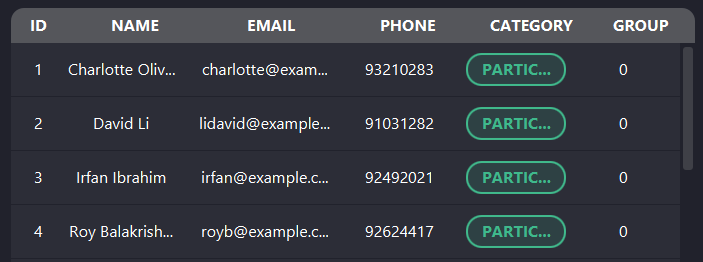

- After executing `group 1 3` 
  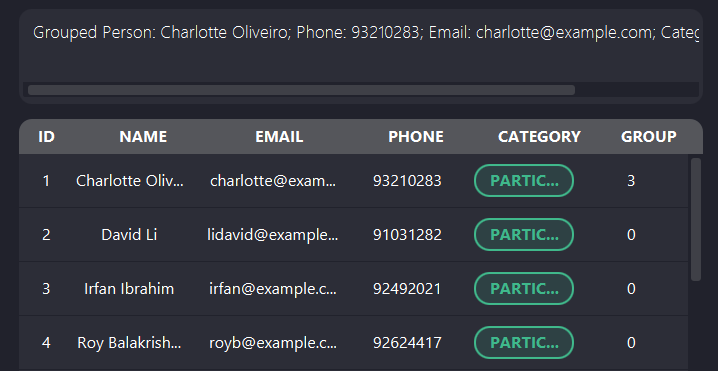

:information_source: **Notes about command constraints:**

- You can only randomly assign a person to an **existing group**.

- When no group exist you _cannot_ randomly assign a person into a group.

- You can only group staff and participant, sponsor cannot be grouped.

- As the maximum number of entries in the contact list is 2147483647, the id should be a positive integer smaller than
  2147483648.

### Grouping randomly listed persons : `grouprandom`

Assigns a random group to each participant and staff that are currently listed.

**Format:** `grouprandom MAXIMUM_GROUP_SIZE`

**Parameters:**

- `MAXIMUM_GROUP_SIZE`: the maximum number of people in a group. Can be any positive integer smaller than 2147483648.

**Example:**

- `grouprandom 2`

- Before 
  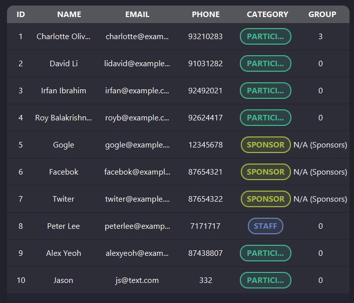

- After executing `grouprandom 2` 
  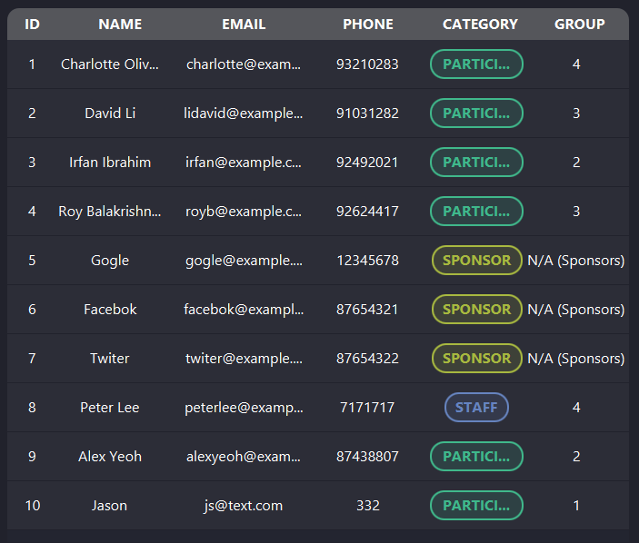

:information_source: **Note:** Like `group` command, you can only group staff and participant, sponsor cannot be
grouped.

### Commenting a person : `comment`

Add notes or comments to contacts.

**Format:** `comment ID NOTES`

**Parameters:**

- `ID`: the id of the person to comment on
- `NOTES`: the comment to give

**Example:**

- `comment 1 Allergic to peanuts`
  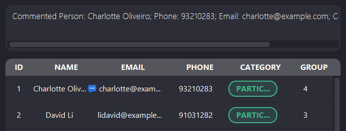

  The dialog icon appearing next to the person name indicates that they have a comment.

:information_source: **Note:**

- **Adding a new comment on a person will replace any comments they have.** The comment is not appended to the existing
  comment. This is to prevent the comment from becoming too long and unreadable. Also it ensures that the comment is
  up-to-date. Please write the overall comment in current state by considering the previous comments.

- **All commas in your comment will be automatically removed** when it is inserted into the application for
  compatibility with link command(csv exporting).

- The comment format does not restrict the use of special characters. However, some special characters that are not
  supported by the system might be displayed differently in the application. It is recommended to use only alphanumeric
  characters and common punctuation marks. Use of special characters is at your own risk.

- The comment is a section for taking your important notes about the person. It is not meant to be used as a
  full-detailed description or review of the person. If you need to store more information, consider using a separate
  document.

- As the maximum number of entries in the contact list is 2147483647, the id should be a positive integer smaller than
  2147483648.

- The default comment for a person without any assigned comment is `No comment provided.`

- There is no separate command to reset or delete a comment. You can always replace the existing comment with a new one
  by using the `comment` command, but if you still want to remove the dialog icon, you can manually remove it by setting
the comment to default comment `No comment provided.`

### Viewing comments : `view`

View comment of a specific contact

**Format:** `view ID`

**Parameter:**

- `ID`: the index of the contact in the list

**Example:** `view 1`
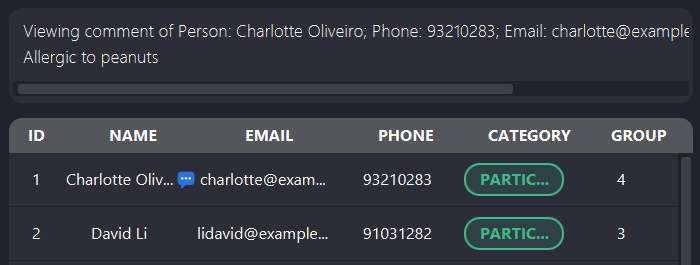

:information_source: **Note:**

- As the maximum number of entries in the contact list is 2147483647, the id should be a positive integer smaller than
  2147483648.

- If the person does not have a comment, you can still use the `view` command to check if they have a comment or not.
  The application will display the default comment 'No comment provided.'.

- As mentioned in comment command, commas in the comment might cause the csv file to be corrupted, so they are removed
  from your input.

- As mentioned in comment command, some special characters that are not supported by the system might be displayed
  differently in the application. It is recommended to use only alphanumeric characters and common punctuation marks
  when making comment. Use of special characters is at your own risk.

- `Redo` and `Undo` commands are not supported for `view` command.

### Locating persons by keywords : `find`

Finds persons who contain any of the given keywords.

**Format:** `find KEYWORD [MORE_KEYWORDS]…`

- The search is case-insensitive. e.g. `hans` will match `Hans`
- The order of the keywords does not matter. e.g. `Hans Bo` will match `Bo Hans`
- Full text of a person is searched, i.e. their name, email, phone number, group number, category and comments if any.
- Only full words will be matched e.g. `Han` will not match `Hans`
- Persons matching at least one keyword will be returned (i.e. `OR` search).
  e.g. `Hans Bo` will return `Hans Gruber`, `Bo Yang`
- Comment is also searched. e.g. `peanuts` will match `Allergic to peanuts`

**Aliases:** `f`

**Examples:**

- `find John` returns a list that includes `john` and `John Doe`
- `find alex david` returns a list that includes `Alex Yeoh`, `David Li` 
  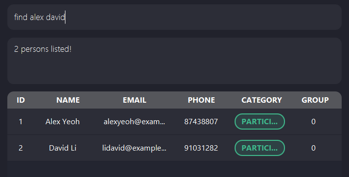
- `find participant` returns a list that includes all participants in the list
- `find 1` returns a list that includes the person with group number 1

### Exporting selected people : `link`

Produce a csv file with selected contacts' information.(name, phone, email, and comment)
The csv file will be saved in the `selectedPeople` folder in the same directory as the `HackLink.jar` file, with the name
`list.csv`. If the folder does not exist, it will be created. If the file already exists, it will be overwritten.

**Format:** `link ID [MORE_ID]…`

**Parameters:**

- `ID`, `MORE_ID`: index(es) of the selected contact(s)

:information_source: **Notes on parameter constraints:**

- The order of the ids does not matter.
- The ids should be positive integers and valid and in the list.
- The ids should be separated by a space.
- There should be no duplicate ids.

**Examples:**

- `link 1 2 3` returns a csv file with the information of people with index 1, 2, and 3
- `link 1` returns a csv file with the information of person with index 1
- `link 1 2 3 4 5` returns a csv file with the information of people 1, 2, 3, 4, and 5

:exclamation: **Caution:**

- As mentioned in [`comment` command](#commenting-a-person--comment), commas in the comment might cause the csv file to
  be corrupted, so they are removed from your input. Avoid using commas.

- As mentioned in [`comment` command](#commenting-a-person--comment), some special characters that are not supported by
  the system might be displayed differently in the application. Some special characters and emojis might be displayed as
`??` in the csv file. It is recommended to use only alphanumeric characters and common punctuation marks when making comment. Use of special characters is at your own risk.

- Do not open the `list.csv` file while the application is running. The file should be closed to write to it. Opening
  the file while the application is running may cause errors.

- As the maximum number of entries in the contact list is 2147483647, the id should be a positive integer smaller than
  2147483648.
- The `link` command does not support `undo` and `redo` commands.

### Removing a person : `delete`

Deletes the person identified by the index shown in the displayed person list.

**Format:** `delete ID`

**Parameters:** `ID`: the id of the person to be deleted. Must exist in the list shown in the app.

**Aliases:** `d`

**Examples:**

- `delete 1` deletes the first person in the list.

## Event features

:information_source: **Note**: For event features, you need to navigate to the event window by clicking on the Events
menu in the menubar.
Refer to the [Event Window](#event-window) section for more details.

### Adding an event : `addevent`

Adds an event to HackLink with a name, date and category where the category represents who the event involves.

**Format:** `addevent en/EVENTNAME ed/EVENTDATE ec/EVENTCATEGORY`

**Parameters:**

- `EVENTNAME`: Name of the event. Only alphanumeric characters and spaces are allowed.
- `EVENTDATE`: Date of the event in format dd-MM-yyyy (e.g. 20-06-2024)
- `EVENTCATEGORY`: Type of the event. Either Participant, Sponsor, or Staff

**Examples:**

- `addevent en/conference ed/22-06-2024 ec/participant`
- `addevent en/meeting ed/11-06-2024 ec/staff`

:information_source: **Note:** This app is designed for small hackathons. However, the maximum number of events entries
is 2147483647. Please delete some events to add a new event if you reach the limit.

### Listing all events : `listevent`

Shows a list of all events in HackLink.
The table will show all the data

**Format:** `listevent`

### Removing an event : `deleteevent`

Remove specific events from the database.

**Format:** `deleteevent ID`

**Parameters:**

- `ID`: the id of the event in the list (positive integer smaller than 2147483648)

**Example:**

- `deleteevent 1`

### Locating events by keywords : `findevent`

Finds events which contain any of the given keywords.

**Format:** `findevent KEYWORD [MORE_KEYWORDS]`

- The search is case-insensitive. e.g. `meeting` will match `Meeting`
- The order of the keywords does not matter. e.g. `Lecture git` will match `git Lecture`
- Full text of an event is searched.
- Only full words will be matched e.g. `Seminar` will not match `Seminars`
- Events matching at least one keyword will be returned (i.e. `OR` search).
  e.g. `Lecture 1` will return `Lecture 2`, `Lecture 3`

**Examples:**

- `findevent meeting` returns `meeting 1` and `meeting 2`
- `findevent lecture` returns `AI lecture`, `OS lecture` 
- `findevent participant` returns all events for participants in the list

### Clearing all entries : `clear`

Clears all entries from the database, either the persons or events.

**Format:** `clear`

- Inputting the clear command in the **main window** clears all **persons**.
- Inputting the clear command in the **events window** clears all **events**.

### Exiting the program : `exit`

Exits the program.

**Format:** `exit`

**Aliases:** `ex`

**Note**: `exit` cannot be used in event window

## Utility features

### Saving the data

HackLink data are saved in the hard disk automatically after any command that changes the data. There is no need to save
manually.

### Editing the data file

HackLink data are saved automatically as a JSON file `[JAR file location]/data/addressbook.json`. Advanced users are
welcome to update data directly by editing that data file.

:exclamation: **Caution:** 
If your changes to the data file makes its format invalid, HackLink will discard all data and start with an empty data file at the next run. Hence, it is recommended to take a backup of the file before editing it. 
Furthermore, certain edits can cause the HackLink to behave in unexpected ways (e.g., if the value entered is outside the acceptable range). Therefore, edit the data file only if you are confident that you can update it correctly.

### Undo

You can undo the last **changes made to the contact list** by using `undo` command. This will revert the last command
that changed the data.

**Format:** `undo`

**Aliases:** `ud`

### Redo

You can redo the last command that was undone by using `redo` command.

**Format:** `redo`

**Aliases:** `rd`

:information_source: **Note:** `undo` and `redo` currently are **not supported on event window**. This means that you
cannot use these commands to revert the changes made to the event list.

### Navigating to older commands

HackLink allows you to navigate to older commands using the up and down arrow keys. This feature is useful when you want
to repeat a command you have previously entered.

### Aliases

Aliases are shortcuts for commands. In each command, you can use the alias in place of the command word, unless
specified otherwise by the command. Please refer to each command details for the alias. 

**Example:**

- [Delete command](#removing-a-person--delete) has command word `delete` and alias `d`. `d 1` and `delete 1` both
  deletes the person at index 1.
- [Adding command](#adding-a-person--add) has command word `add` and alias `ap` for adding participant. You don't need
  to include participant parameter when using this alias for `add` command. 
  `add n/John e/john@mail.com p/84831193 c/participant` and `ap n/John e/john@mail.com p/84831193` both adds new
  participant
  named "John" with given information to the contact list.

### Shortcuts

Shortcuts are a way to quickly perform action from the keyboard. The available shortcuts are:

- `F1` : Opens the help window
- `F2` : Focus on the command box
- `F3` : Focus on the result box (to scroll up and down in case of overflow)
- `F4` : Focus on the list of contacts (to scroll up and down in case of overflow)

---

## Event window

Events are shown in a separate window. You can navigate to the event window by clicking on the Events menu in the
menubar.

An event window will appear with a list of events. You can add, delete, and find events in the event window. Note how
the app contains some sample data for the events. 
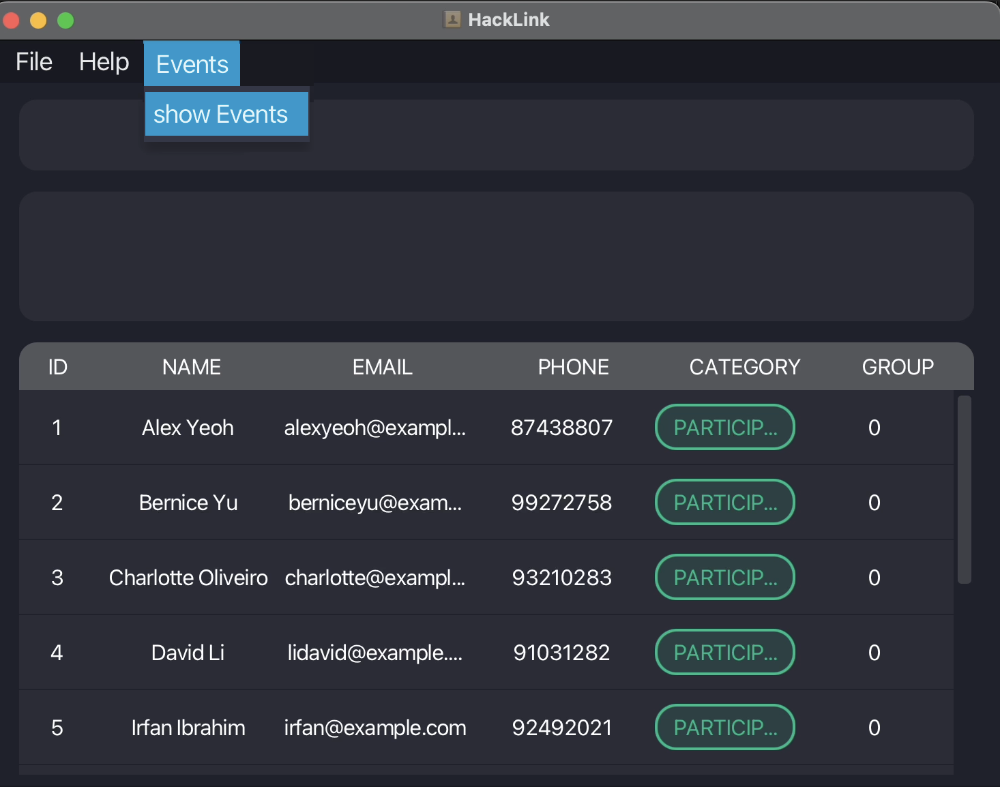

You can get back to the main window by clicking on the Back to Main on the menubar. 
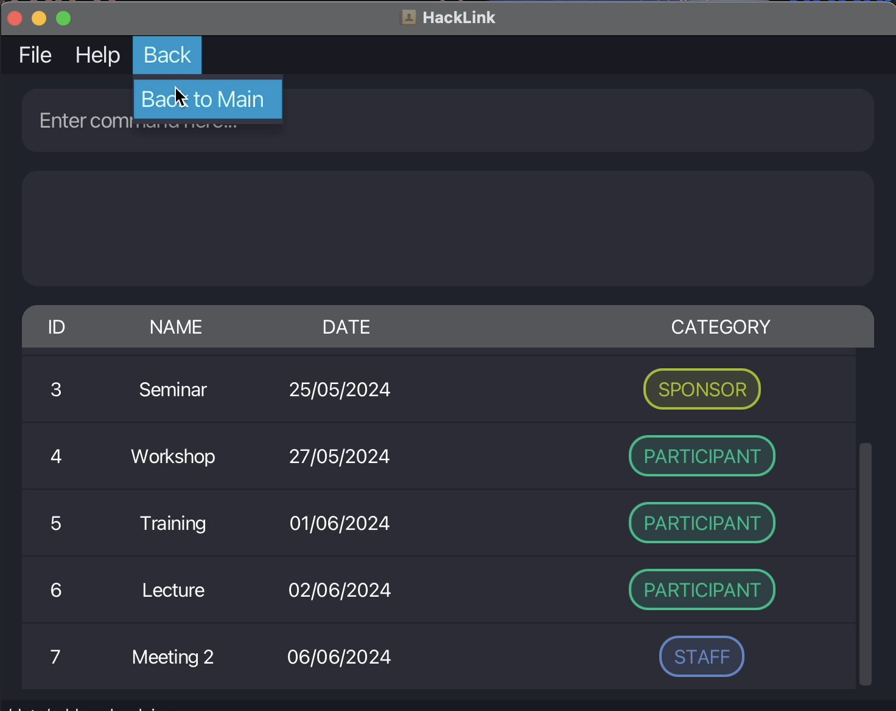

---

## FAQ

**Q**: How do I transfer my data to another Computer? 
**A**: Install the app in the other computer and overwrite the empty data file it creates with the file that contains
the data of your previous HackLink home folder.

---

## Warnings

1. **Invalid Command** : When a command format is incorrect or parameters are missing, the application will prompt the
   user with a warning message.
2. **Command Failure** : If the person specified for editing or removing does not exist in the database, the application
   should display a warning message indicating the failure.
3. **Invalid input for update** : If the input for editing a person's information is invalid, the application should
   display a warning message indicating the failure and provide guidance on the correct format.

---

## Known issues

1. **When using multiple screens**, if you move the application to a secondary screen, and later switch to using only
   the primary screen, the GUI will open off-screen. The remedy is to delete the `preferences.json` file created by the
   application before running the application again.
2. When **undoing a deletion** by `undo` command after a `delete` command, the restored contact may not appear at the
   same row and/or having the same ID as the original contact. Refer to the example below:  
   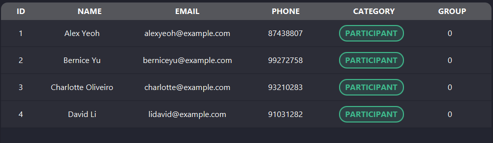
    - `delete 2` deletes the person with ID 2 ("Bernice Yu") in the contact list
      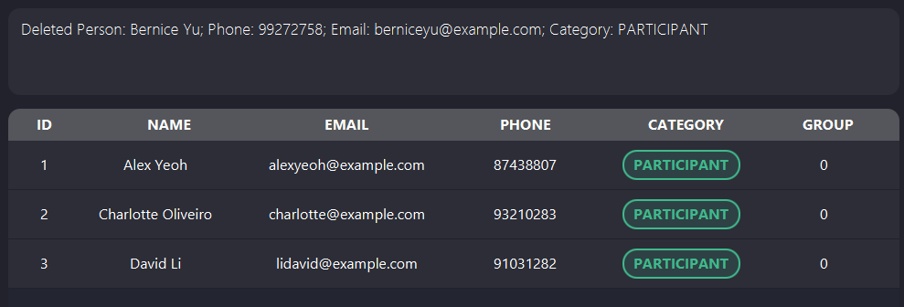
    - `undo` re-adds this person back to the list, but with a different ID (4 instead of 2)
      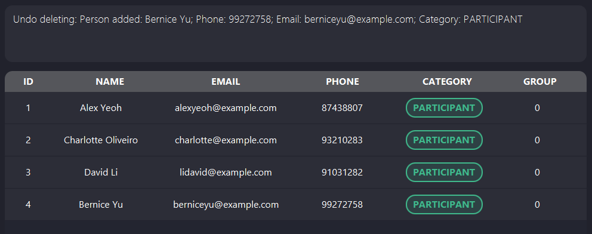
    - `delete 2` does not guarantee to delete the same person again  
      The suggested workaround is to use [`redo` command](#redo) to delete the same person again, or to search for that
      exact person using [`find` command](#locating-persons-by-keywords--find) and delete them.

---

## Tips

1. **Use Descriptive Command Names**: You are encouraged to use descriptive names when adding, updating, or removing
   participants. This makes it easier to identify and manage individuals within the application.
2. **Utilize the utility features**: The application provides utility features such as navigating to older commands,
   aliases, and shortcuts. These features can help you manage your data more efficiently.

---

## Command summary

| Action             | Format, Examples                                                                                                                         |
|--------------------|------------------------------------------------------------------------------------------------------------------------------------------|
| **Add**            | `add n/NAME p/PHONE_NUMBER e/EMAIL c/CATEGORY [g/GROUP]​`   e.g., `add n/James Ho p/22224444 e/jamesho@example.com c/participant g/3` |
| **Clear**          | `clear`                                                                                                                                  |
| **Remove**         | `delete ID`  e.g., `delete 3`                                                                                                         |
| **Edit**           | `edit ID [n/NAME] [p/PHONE] [e/EMAIL] [g/GROUP]​`  e.g.,`edit 2 n/James Lee e/jameslee@example.com`                                   |
| **Group**          | `group ID [GROUP_NUMBER]`  e.g., `group 1 3`                                                                                          |
| **Group Randomly** | `grouprandom MAXIMUM_GROUP_SIZE`  e.g., `grouprandom 3`                                                                               |
| **Find**           | `find KEYWORD [MORE_KEYWORDS]...`  e.g., `find James Jake`                                                                            |
| **List**           | `list`                                                                                                                                   |
| **Link**           | `link ID [MORE_ID]...`  e.g., `link 1 2 3`                                                                                            |
| **Comment**        | `comment ID NOTES`  e.g., `comment 1 Allergic to peanuts`                                                                             |
| **View**           | `view ID`   e.g., `view 1`                                                                                                            |
| **AddEvent**       | `addevent en/EVENTNAME ed/EVENTDATE ec/EVENTCATEGORY`  e.g., `addevent en/meeting3 ed/11-06-2024 ec/staff`                            |
| **ListEvent**      | `listevent`                                                                                                                              |
| **DeleteEvent**    | `deleteevent ID`  e.g., `deleteevent 8`                                                                                               |
| **FindEvent**      | `findevent KEYWORD [MORE_KEYWORDS]`  e.g., `findevent meeting`                                                                        |
| **Help**           | `help`                                                                                                                                   |
| **Exit**           | `exit`                                                                                                                                   | 
| **Undo**           | `undo`                                                                                                                                   |
| **Redo**           | `redo`                                                                                                                                   |
