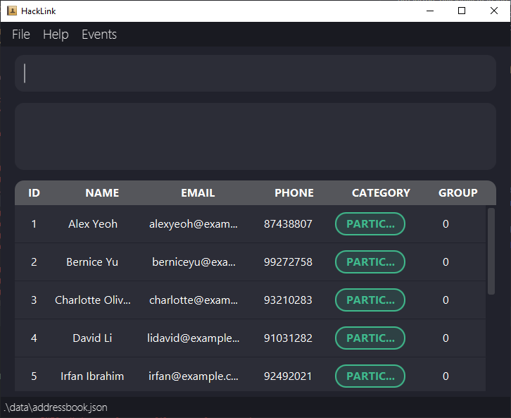
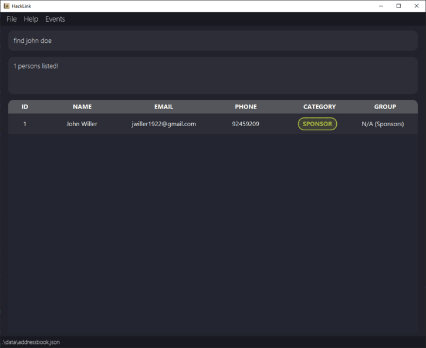

# WELCOME TO HACKLINK!

HackLink is a Hackathon Participant Management Application, designed to help organizers efficiently manage participant information for hackathons. With features such as finding, sorting, adding, and deleting participants, you can streamline the process of organizing and coordinating your hackathon event.

- Table of Contents

1. [Quick start](#quick-start)
2. [Features](#features)

   2.1 [Main features](#main-features)

   - [Viewing help](#viewing-help--help)
   - [Adding a person](#adding-a-person--add)
   - [Listing all persons](#listing-all-persons--list)
   - [Editing a person](#editing-a-person--edit)
   - [Grouping a person](#grouping-a-person--group)
   - [Grouping randomly listed persons](#grouping-randomly-listed-persons--grouprandom)
   - [Commenting a person](#commenting-a-person--comment)
   - [Viewing comments](#viewing-comments--view)
   - [Locating persons by keywords](#locating-persons-by-keywords--find)
   - [Exporting a selected participants](#exporting-selected-participants--link)
   - [Removing a person](#removing-a-person--remove)
   - [Clearing all entries](#clearing-all-entries--clear)
   - [Adding an event](#adding-an-event--addevent)
   - [Listing all events](#listing-all-events--listevent)
   - [Removing an event](#removing-an-event--deleteevent)
   - [Locating events by keywords](#locating-events-by-keywords--findevent)
   - [Exiting the program](#exiting-the-program--exit)

     2.2 [Utility features](#utility-features)

   - [Saving the data](#saving-the-data)
   - [Editing the data file](#editing-the-data-file)
   - [Navigating to older commands](#navigating-to-older-commands)
   - [Aliases](#aliases)
   - [Shortcuts](#shortcuts)

3. [FAQ](#faq)
4. [Warnings](#warnings)
5. [Known issues](#known-issues)
6. [Tips](#tips)
7. [Command summary](#command-summary)

---

# Quick start

1. Ensure you have Java `11` or above installed in your Computer.

2. Download the latest `HackLink.jar` from [here](link to release).

3. Copy the file to the folder you want to use as the _home folder_ for your HakcLink application.

4. Open a command terminal, `cd` into the folder you put the jar file in, and use the `java -jar HackLink.jar` command to run the application. 
   A GUI similar to the below should appear in a few seconds. Note how the app contains some sample data. 
   

5. Type the command in the command box and press Enter to execute it. e.g. typing **`help`** and pressing Enter will open the help window. 
   Some example commands you can try:

   - `list` : Lists all contacts.

   - `add n/John Doe p/98765432 e/johndoe@gmail.com c/participant` : Adds a person named `John Doe` to HackLink.

   - `delete 3` : Deletes the 3rd person shown in the current list.

   - `edit 2 p/23443596` : Updates the phone number of the person with ID 2 in the list

   - `clear` : Deletes all contact information.

   * `addevent en/Meeting ed/11-06-2024 ec/staff` : Adds an event named `meeting`.

   * `deleteevent 8` : Deletes the 8th event shown in the list.
   * `findevent meeting` : Finds events which names contain "meeting".

   * `listevent` : Lists all events.

   - `exit` : Exits the app.

6. Refer to the [Features](#features) below for details of each command.

---

# Features

**:information_source: Notes about the command format:** 

- Words in `UPPER_CASE` are the parameters to be supplied by the user. 
  e.g. in `add n/NAME`, `NAME` is a parameter which can be used as `add n/John Doe`.

- Items with `…`​ after them can be used multiple times including zero times. 
  e.g. `[c/CATEGORY]…​` can be used as ` ` (i.e. 0 times), `c/staff`, `c/sponsor` etc.

- Parameters can be in any order. 
  e.g. if the command specifies `n/NAME p/PHONE_NUMBER`, `p/PHONE_NUMBER n/NAME` is also acceptable.

- Extraneous parameters for commands that do not take in parameters (such as `help`, `list`, `exit` and `clear`) will be ignored. 
  e.g. if the command specifies `help 123`, it will be interpreted as `help`.

- Some commands have aliases. The aliases are shown in the command details. Please refer to [Aliases](#aliases) for more information.

- If you are using a PDF version of this document, be careful when copying and pasting commands that span multiple lines as space characters surrounding line-breaks may be omitted when copied over to the application.

## Main features

### Viewing help : `help`

Shows a message explaning how to access the help page.

Format: `help`

### Adding a person: `add`

Adds a person to HackLink.

Format: `add n/NAME p/PHONE e/EMAIL c/CATEGORY g/GROUP`

Aliases:

- `ap`: add participant
- `as`: add sponsor
- `at`: add staff
  You can skip the category parameter and the application will automatically assign the category based on the alias used.

:bulb:

Examples:

- `add n/John Doe e/johnd@example.com p/98765432 c/participant g/1`
- `add n/Betsy Crowe e/betsycrowe@example.com p/1234567 c/sponsor g/3`
- `ap n/John Doe e/johnd@example.com p/98765432`

Cautions / Warnings for Add:

- There should be no “/” in each parameter.
- There should be no contacts with the same information.
- Category should be one of Participant, Sponsor, and Staff.

### Listing all persons : `list`

Shows a list of all persons in HackLink.
Example: `Total: <total number of data>`
The table will show all the data

Format: `list`

### Editing a person : `edit`

Update and edit participant contact details.

Format: `edit <id> /<field that needs update> <new value>`
Acceptable values for each parameter

- `<id>`: the id of the contact in the list.
- `<field>`: name, email, phone, category, group.
- `<new value>`: follow the format of its field.

Aliases: `ed`

Cautions / Warnings for Edit:

- There should be no “/” in each parameter.
- There should be only one field rather than multiple fields.
- Updated information should be different from the original.

### Grouping a person : `group`

Assigns a group to a participant or a staff.

Format: `group <id> [<group number>]`

- You can only randomly assign a person to an existing group.
- The `<id>` refers to the identification number of the contact in the list
- The `<group number>` can be any positive integer
- You can only group staff and participant, sponsor cannot be grouped

Examples:

- `group 1`
- `group 1 3`

Tips for Group:

- Not typing the group number will randomly assign the person into an existing group.

Cautions / Warnings for Group:

- When no group exist you cannot randomly assign a person into a group.

### Grouping randomly listed persons : `grouprandom`

Assigns a random group to each participant and staff that are currently listed.

Format: `grouprandom <maximum group size>`

- The `<maximum group size>` refers to the maximum number of people in a group
- The `<maximum group size>` can be any positive integer
- You can only group staff and participant, sponsor cannot be grouped

Example:

- `grouprandom 3`

### Commenting a person : `comment`

Add notes or comments to contacts
format `comment <id>, <notes>`

Example:

- `comment 1, Allergic to peanuts`

Acceptable values for each parameter:

- `<id>`: the id of the contact in the list
- `<note>`: any string

Precise expected outputs when the command succeeds:

- Commented person: <name> <phone> <email> <category>

Precise expected outputs when the command fails:

- Error: Invalid command format. (when note is not provided)

### Viewing comments : `view`

view comments of a specific contact
format `view <id>`

Example:`view 1`

Acceptable values for each parameter:

- `<id>`: the id of the contact in the list

Precise expected outputs when the command succeeds:

- Viewing comments of Person: <name> <phone> <email> <category>

Precise expected outputs when the command fails:

- Error: Invalid command format. (when id is not provided)

### Locating persons by keywords : `find`

Finds persons who contain any of the given keywords.

Format: `find KEYWORD [MORE_KEYWORDS]`

- The search is case-insensitive. e.g `hans` will match `Hans`
- The order of the keywords does not matter. e.g. `Hans Bo` will match `Bo Hans`
- Full text of a person is searched.
- Only full words will be matched e.g. `Han` will not match `Hans`
- Persons matching at least one keyword will be returned (i.e. `OR` search).
  e.g. `Hans Bo` will return `Hans Gruber`, `Bo Yang`

Aliases: `f`

Examples:

- `find John` returns `john` and `John Doe`
- `find alex david` returns `Alex Yeoh`, `David Li` 
  
- `find participant` returns all participants in the list

### Exporting selected participants : `link`

Produce a csv file with selected participants' contact information to provide to sponsor.
The csv file will be saved in the selectedParticipants folder with the name list.csv.

Format: `link ID [MORE_ID]`

- The number of ids is not limited
- The order of the ids does not matter
- The ids should be valid and in the list
- The ids should be separated by a space

Examples:

- `link 1 2 3` returns a csv file with the contact information of participants 1, 2, and 3
- `link 1` returns a csv file with the contact information of participant 1
- `link 1 2 3 4 5` returns a csv file with the contact information of participants 1, 2, 3, 4, and 5

Warning:

- comma in the comment might cause the csv file to be corrupted.
  Do not open the list.csv file while the application is running.

### Removing a person : `delete`

Deletes the person identified by the index shown in the displayed person list.

Format: `delete ID`

- The ID used must exist in the list.

Aliases: `d`

Examples:

- `delete 1` deletes the first person in the list.

### Adding an event: `addevent`

Adds an event to HackLink.

Format: `add en/EVENTNAME ed/EVENTDATE c/EVENTCATEGORY`

:bulb:

Examples:

- `add addevent en/meeting ed/11-06-2024 ec/staff`
- `add addevent en/conference ed/22-06-2024 ec/participant`

Cautions / Warnings for Addevent:

- There should be no “/” in each parameter.
- Category should be one of Participant, Sponsor, and Staff.

### Listing all events : `listevent`

Shows a list of all events in HackLink.
Example: `Total: <total number of data>`
The table will show all the data

Format: `listevent`

### Removing an event : `deleteevent`

Remove specific events from the database.

Format: `deleteevent <id>`
Example:
`deleteevent 1`
Acceptable values for each parameter

- `<id>`: the id of the event in the list

Precise expected outputs when the command succeeds

- You have successfully deleted <category> <name>.
  Example: You have successfully deleted event meeting.
  Precise expected outputs when the command fails
- Error: no event with id <id>. (when event is not in the list)

### Locating events by keywords : `findevent`

Finds events which contain any of the given keywords.

Format: `findevent KEYWORD [MORE_KEYWORDS]`

- The search is case-insensitive. e.g `meeting` will match `Meeting`
- The order of the keywords does not matter. e.g. `Lecture git` will match `git Lecutre`
- Full text of a event is searched.
- Only full words will be matched e.g. `Seminar` will not match `Seminars`
- Events matching at least one keyword will be returned (i.e. `OR` search).
  e.g. `Lecture 1` will return `Lecture 2`, `Lecture 3`

Examples:

- `findevent meeting` returns `meeting 1` and `meeting 2`
- `findevent lecture` returns `AI lecture`, `OS lecture` 
- `findevent participant` returns all events for participants in the list

### Clearing all entries : `clear`

Clears all entries from the database.

Format: `clear`

### Exiting the program : `exit`

Exits the program.

Format: `exit`

## Utility features

### Saving the data

HackLink data are saved in the hard disk automatically after any command that changes the data. There is no need to save manually.

### Editing the data file

HackLink data are saved automatically as a JSON file `[JAR file location]/data/addressbook.json`. Advanced users are welcome to update data directly by editing that data file.

:exclamation: **Caution:**
If your changes to the data file makes its format invalid, HackLink will discard all data and start with an empty data file at the next run. Hence, it is recommended to take a backup of the file before editing it. 
Furthermore, certain edits can cause the HackLink to behave in unexpected ways (e.g., if a value entered is outside of the acceptable range). Therefore, edit the data file only if you are confident that you can update it correctly.

### Navigating to older commands

HackLink allows you to navigate to older commands using the up and down arrow keys. This feature is useful when you want to repeat a command you have previously entered.

### Aliases

Aliases are shortcuts for commands. In each command, you can use the alias instead of the full command. Please refer to each command details for the alias.

### Shortcuts

Shortcuts are a way to quickly perform action from the keyboard. The available shortcuts are:

- `F1` : Opens the help window
- `F2` : Focus on the command box
- `F3` : Focus on the result box (to scroll up and down in case of overflow)
- `F4` : Focus on the list of contacts (to scroll up and down in case of overflow)

---

## FAQ

**Q**: How do I transfer my data to another Computer? 
**A**: Install the app in the other computer and overwrite the empty data file it creates with the file that contains the data of your previous AddressBook home folder.

---

## Warnings

1. **Invalid Command** : When a command format is incorrect or parameters are missing, the application will prompt the user with a warning message.
2. **Command Failure** : If the person specified for editing or removing does not exist in the database, the application should display a warning message indicating the failure.
3. **Invalid input for update** : If the input for editing a person's information is invalid, the application should display a warning message indicating the failure and provide guidance on the correct format.

---

## Known issues

1. **When using multiple screens**, if you move the application to a secondary screen, and later switch to using only the primary screen, the GUI will open off-screen. The remedy is to delete the `preferences.json` file created by the application before running the application again.

---

## Tips

1. **Use Descriptive Command Names**: You are encouraged to use descriptive names when adding, updating, or removing participants. This makes it easier to identify and manage individuals within the application.
2. **Utilize the utility features**: The application provides utility features such as navigating to older commands, aliases, and shortcuts. These features can help you manage your data more efficiently.

---

## Command summary

| Action             | Format, Examples                                                                                                                                |
| ------------------ | ----------------------------------------------------------------------------------------------------------------------------------------------- |
| **Add**            | `add n/NAME p/PHONE_NUMBER e/EMAIL c/CATEGORY [g/GROUP_NUMBER]​`   e.g., `add n/James Ho p/22224444 e/jamesho@example.com c/participant g/3` |
| **Clear**          | `clear`                                                                                                                                         |
| **Remove**         | `delete INDEX`  e.g., `delete 3`                                                                                                             |
| **Edit**           | `edit INDEX [n/NAME] [p/PHONE_NUMBER] [e/EMAIL] [c/CATEGORY] [g/GROUP_NUMBER]​`  e.g.,`edit 2 n/James Lee e/jameslee@example.com`            |
| **Group**          | `group INDEX [GROUP_NUMBER]`  e.g., `group 1 3`                                                                                              |
| **Group Randomly** | `grouprandom MAX_GROUP_SIZE`  e.g., `grouprandom 3`                                                                                          |
| **Find**           | `find KEYWORD [MORE_KEYWORDS]`  e.g., `find James Jake`                                                                                      |
| **List**           | `list`                                                                                                                                          |
| **Comment**        | `comment <name>, <notes>`                                                                                                                       |
| **AddEvent**       | `addevent en/EVENTNAME ed/EVENTDATE ec/EVENTCATEGORY`  e.g., `addevent en/meeting3 ed/11-06-2024 ec/staff`                                   |
| **ListEvent**      | `listevent`                                                                                                                                     |
| **DeletEvent**     | `deleteevent INDEX`  e.g., `deleteevent 8`                                                                                                   |
| **FindEvent**      | `findevent KEYWORD [MORE_KEYWORDS]`  e.g., `findevent meeting`                                                                               |
| **Help**           | `help`                                                                                                                                          |
